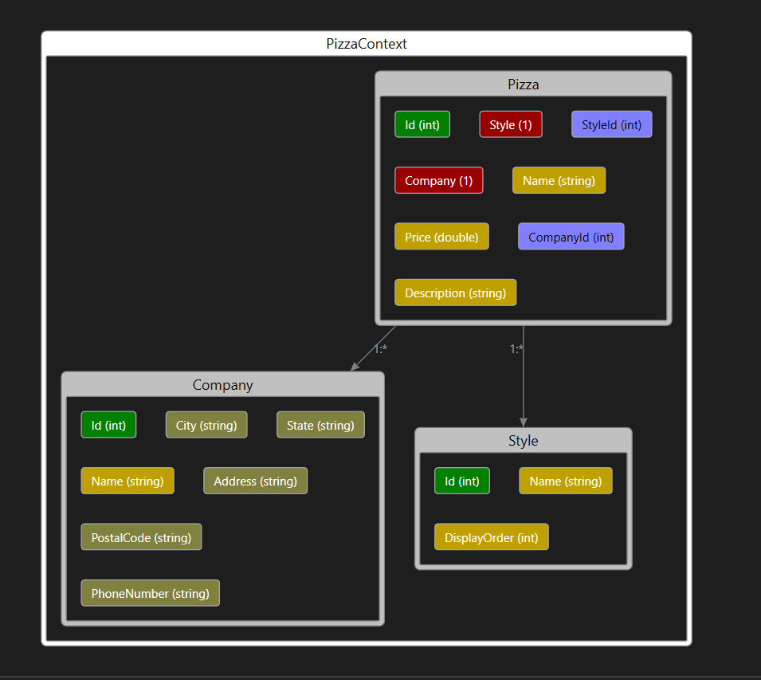

# HotPizzaSolution

Creating an E-commerce website using .NET 8 MVC

Software Used:  .NET 8 Preview, EntityFrameworkCore + tools + SQLServer, BootStrap themes (https://bootswatch.com), Toastr(https://codeseven.github.io/toastr/)

